# Architecture Overview

> **Audience:** Chief Architect and senior engineers owning this codebase long-term.
> This document describes the *system*, not the files. Read it once; use the CLAUDE.md for day-to-day commands.

---

## 1. High-Level Architecture

The repository contains three co-located but independently versioned layers. They share a single git history but have separate package manifests, separate test suites, and a deliberate dependency direction: only `platform/` depends on `aisuite/`; `aisuite/` depends on nothing in `platform/`.

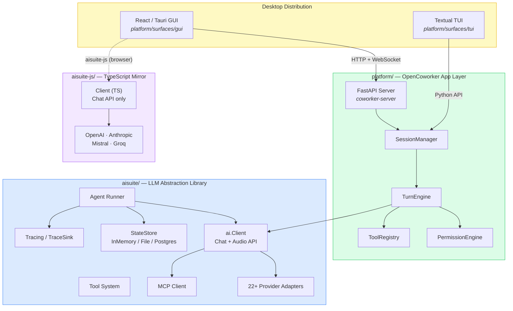

**Dependency rule:** `aisuite/` is a pure library — no imports from `platform/`. `platform/` imports from `aisuite/` (toolkits, tracing, `ai.tool()`). The TypeScript layer `aisuite-js/` is independent.

---

## 2. Major Components

### 2.1 aisuite Library Components

| Component | Location | Responsibility |
|-----------|----------|----------------|
| `Client` | `aisuite/client.py` | Unified entry point: routes `"provider:model"` strings, manages the tool-calling loop when `max_turns` is set, handles MCP inline configs |
| `ProviderFactory` | `aisuite/provider.py` | Convention-based dynamic loader: discovers `{name}_provider.py` files in `aisuite/providers/`, instantiates on first use |
| `Tools` | `aisuite/utils/tools.py` | Infers OpenAI-format JSON schemas from Python function signatures + docstrings (via `docstring-parser` + Pydantic); validates args before execution; applies `ToolPolicy`; emits trace events |
| `Agent` / `Runner` | `aisuite/agents/` | Declarative agent definition + async multi-turn executor; manages `StateStore`, `ArtifactStore`, `TraceSink`, `ToolPolicy` |
| `StateStore` | `aisuite/agents/state_store.py` | Persist/resume run state across processes: `InMemoryStateStore`, `FileStateStore`, `PostgresStateStore` |
| `MCPClient` | `aisuite/mcp/client.py` | Wraps any MCP server (stdio or HTTP) as Python callables; lazy-connect, auto-reconnect |
| Toolkits | `aisuite/toolkits/` | Sandboxed prebuilt tool families: `files()`, `git()`, `shell()` |
| Tracing | `aisuite/tracing/` | Structured `TraceEvent` emission to pluggable `TraceSink`s (JSONL file, HTTP, DB); embedded viewer UI |

### 2.2 Platform (OpenCoworker) Components

| Component | Location | Responsibility |
|-----------|----------|----------------|
| `TurnEngine` | `platform/coworker/engine.py` | Core async event loop: streams model output, authorizes + executes tools, emits typed `Event` objects consumed by surfaces |
| `PermissionEngine` | `platform/coworker/permissions.py` | Mode-based access control gate: DISCUSS / PLAN / INTERACTIVE / AUTO / CUSTOM; path-scopes writes to `RootDir` list |
| `SessionManager` | `platform/coworker/server/manager.py` | Lifecycle of named sessions: create, resume, route events to the appropriate `TurnEngine` |
| `build_engine()` | `platform/coworker/agent.py` | Assembly function: wires agent tools + connectors + web + memory + skills + scheduling into a `ToolRegistry` and `TurnEngine` |
| `ToolRegistry` | `platform/coworker/tools/registry.py` | Named tool store: schema generation, `execute(name, args)`, metadata lookup |
| Platform `ProviderClient` | `platform/coworker/providers/` | **Separate** from aisuite providers — streaming-first, event-driven interface for OpenAI / Anthropic / Google |
| `MemoryStore` | `platform/coworker/memory/` | Durable cross-session facts: GLOBAL / WORKSPACE / SESSION scopes; SQLite backend |
| `SkillLoader` | `platform/coworker/skills/` | Discovers `SKILL.md` modules; progressive disclosure — catalog injected at start, full body loaded on demand |
| Connectors | `platform/coworker/connectors/` | Messaging platform adapters (Slack, Telegram, email) implementing `BasePlatformAdapter` |
| `Scheduler` | `platform/coworker/automation/scheduler.py` | Cron-based task executor with run-once-catch-up and skip-on-overlap policy |
| FastAPI App | `platform/coworker/server/app.py` | HTTP + WebSocket API surface: run lifecycle, approval responses, config |

---

## 3. Startup Flow

There are two startup paths: the desktop app (Tauri sidecar model) and standalone server (`coworker-server`).

### 3.1 Desktop App Startup

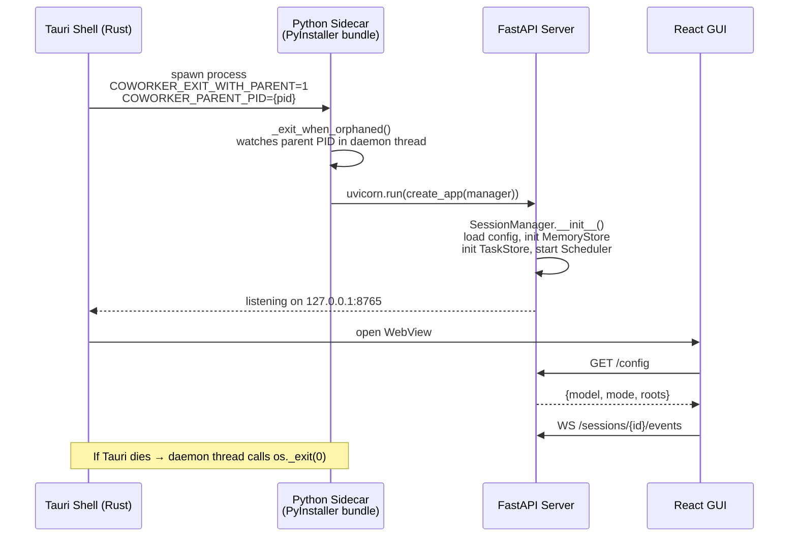

**Orphan guard**: The server registers the parent PID at startup and polls it (POSIX: `kill(pid, 0)`) or blocks on a Windows handle (`WaitForSingleObject`). When the GUI process exits, the sidecar exits immediately — preventing leaked server processes across app restarts.

### 3.2 Standalone Server Startup

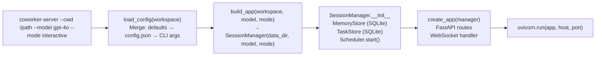

---

## 4. Runtime Architecture

### 4.1 Process Model

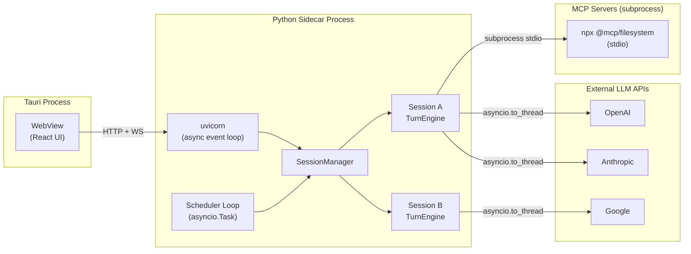

**Key concurrency decisions:**
- The server runs a single asyncio event loop (uvicorn). All sessions share it.
- Provider streaming calls run in a thread pool via `asyncio.to_thread()` so the event loop stays responsive to incoming WebSocket messages (including interrupt signals) during long model calls.
- Tool execution: low-risk tools (`risk_level="low"`) within a single turn execute concurrently with `asyncio.gather()`; write and shell tools execute serially.

### 4.2 Event System

Every `TurnEngine.run()` call is an async generator that yields typed `Event` objects. Surfaces consume them via WebSocket or direct async iteration.

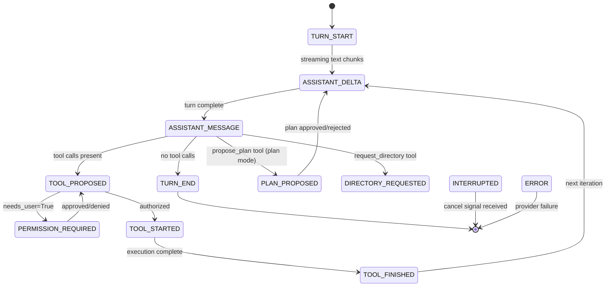

---

## 5. Workspace Management

### 5.1 RootDir Model

A session owns a **list of `RootDir` objects** — the directories it is permitted to access. This list is a **shared mutable reference** passed by pointer to:
- `PermissionEngine` (scopes write operations)
- File toolkit (resolves relative paths)
- `context_provider` lambda (tells the agent which directories exist each turn)

This means a folder grant granted mid-session (via the `request_directory` tool) is immediately visible to all three consumers without rebuilding the engine.

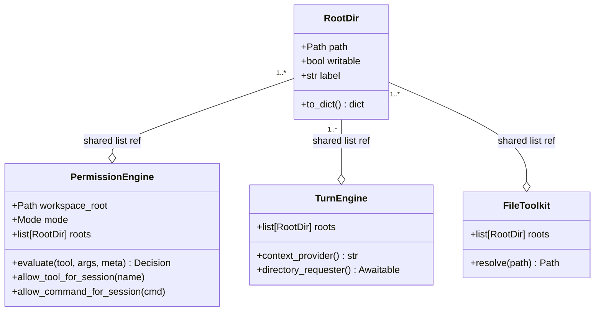

### 5.2 Mode Enforcement and Path Scoping

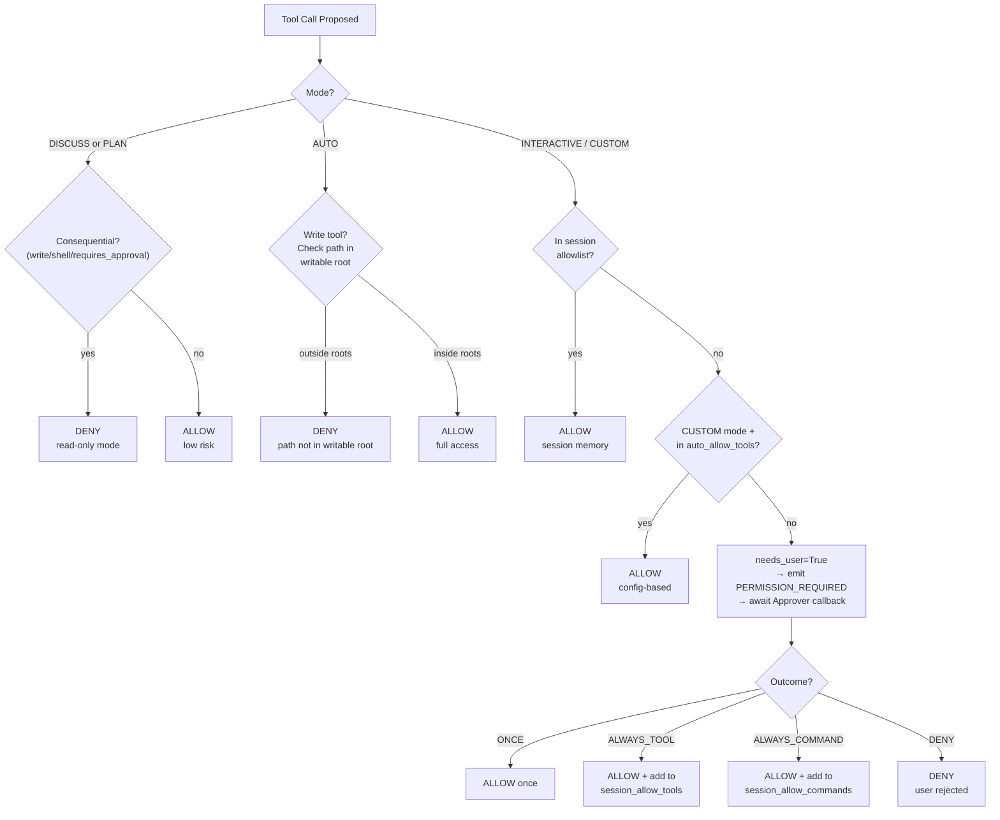

### 5.3 Plan Mode Workflow

Plan mode enforces a structured explore → propose → execute cycle across a single session:

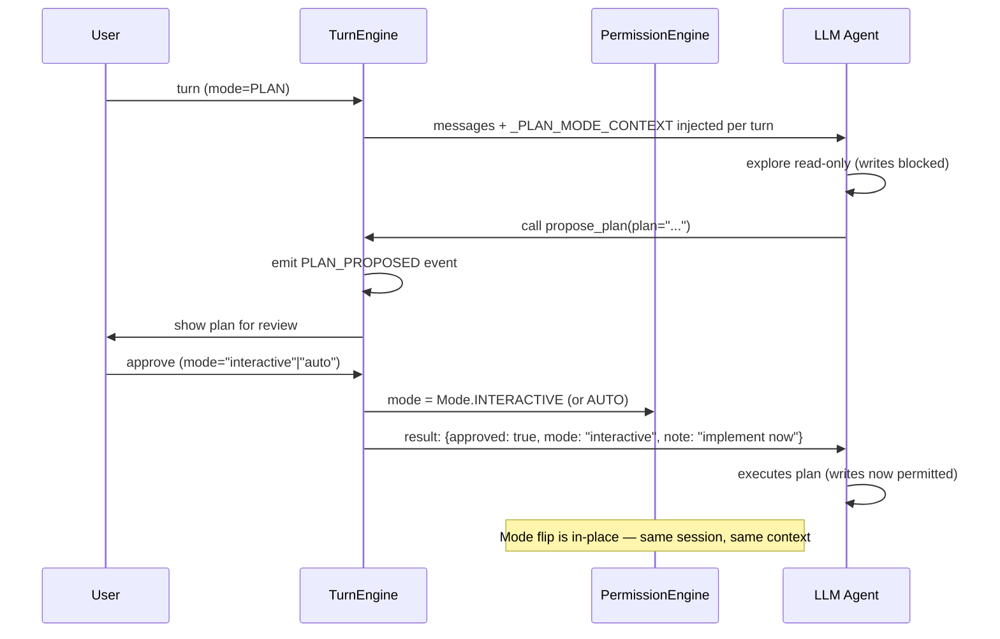

---

## 6. AI Request Lifecycle

This covers one complete user turn from input to final response, including the multi-iteration tool loop.

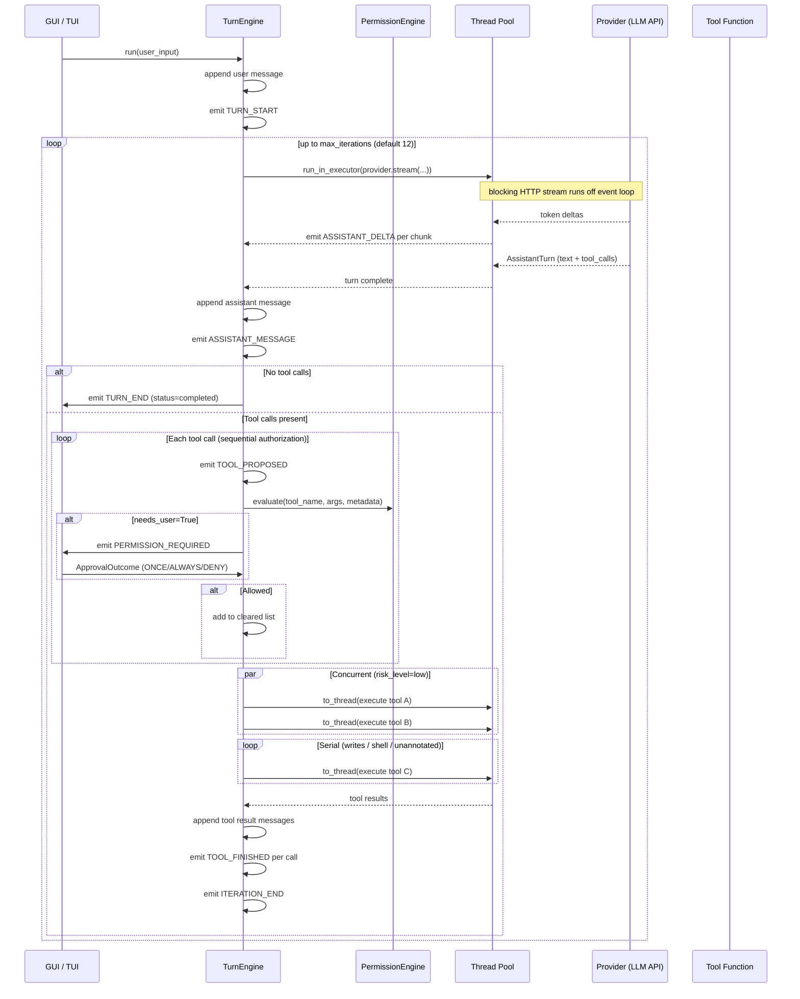

### 6.1 Context Injection

The `context_provider` lambda is called on every outbound model call and appends a `<system-context>` block to the last user message. This block is **never persisted** to `self.messages` — it is injected at send time only, ensuring:
- Plan-mode reminders reflect the live mode (mode can flip mid-session).
- The directory listing reflects the current `RootDir` list (folders can be added mid-session).
- Mid-thread system messages (unreliable across providers) are avoided.

---

## 7. AISuite Integration

### 7.1 Two Provider Abstractions (The Key Architectural Tension)

This codebase contains **two independent provider abstraction layers**:

| Aspect | `aisuite/providers/` | `platform/coworker/providers/` |
|--------|---------------------|-------------------------------|
| **Interface** | `Provider.chat_completions_create()` | `ProviderClient.stream()` → `Iterator[StreamChunk]` |
| **Design goal** | Request/response normalization | Streaming-first, event-driven UI |
| **Async** | Thread-wrapped by default; native async optional | Always streaming via thread + queue bridge |
| **Providers** | 22+ (OpenAI, Anthropic, Google, Groq, Mistral, …) | OpenAI, Anthropic, Google only |
| **Used by** | `ai.Client`, `Runner`, `aisuite-js` | `TurnEngine` (platform) |
| **Tool format** | OpenAI-format JSON dicts | Same, but parsed into `ToolCall` dataclasses |
| **Converges?** | Not yet — intentional divergence for streaming needs | Long-term: consider unifying |

### 7.2 aisuite Tool Calling Flow

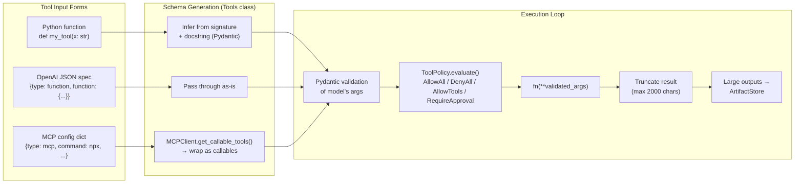

### 7.3 aisuite Runner State Machine

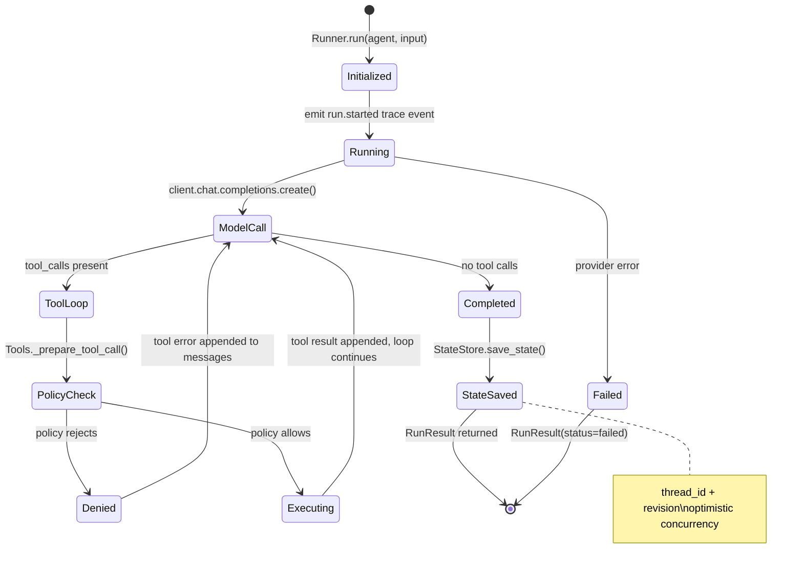

---

## 8. File Management

### 8.1 File Tool Architecture

File operations in the platform layer are sandboxed by a shared `RootDir` list. The file toolkit enforces three invariants:
1. **Reads** must resolve inside any root (read-only or writable).
2. **Writes** must resolve inside a **writable** root — checked by both the file tool itself and by `PermissionEngine`.
3. **Relative paths** resolve against `root_list[0]` (the primary/scratch directory).

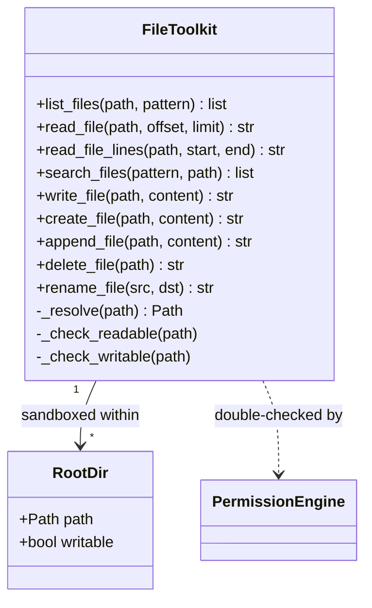

**Risk metadata** on each tool:
- Read tools: `risk_level="low"` — eligible for concurrent execution in the turn loop.
- Write tools: `risk_level="high"`, `requires_approval` where configured — always serial.

### 8.2 ArtifactStore (Large Output Handling)

When tool results exceed the message-size threshold (~2,000 chars), the `ArtifactStore` is used to keep the conversation context window lean:

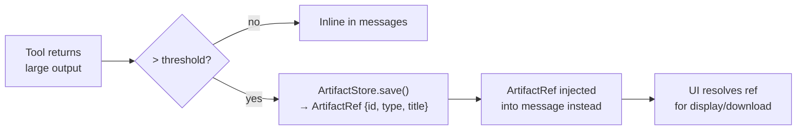

**Implementations:**
- `InMemoryArtifactStore` — testing
- `FileArtifactStore` — disk at `.aisuite/artifacts/{run_id}/{artifact_id}/`

---

## 9. Scheduling Architecture

### 9.1 Scheduler Design

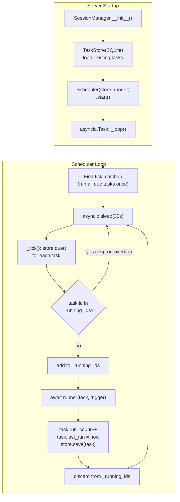

**Two scheduler policies (hard-coded, by design):**
- **Run-once catch-up**: On startup, any task whose `next_run` is in the past fires exactly once. This recovers missed runs from downtime without stacking.
- **Skip-on-overlap**: If a task's previous run is still executing when the next fire time arrives, the new run is silently skipped. Prevents unbounded queuing for slow agents.

### 9.2 Task Lifecycle

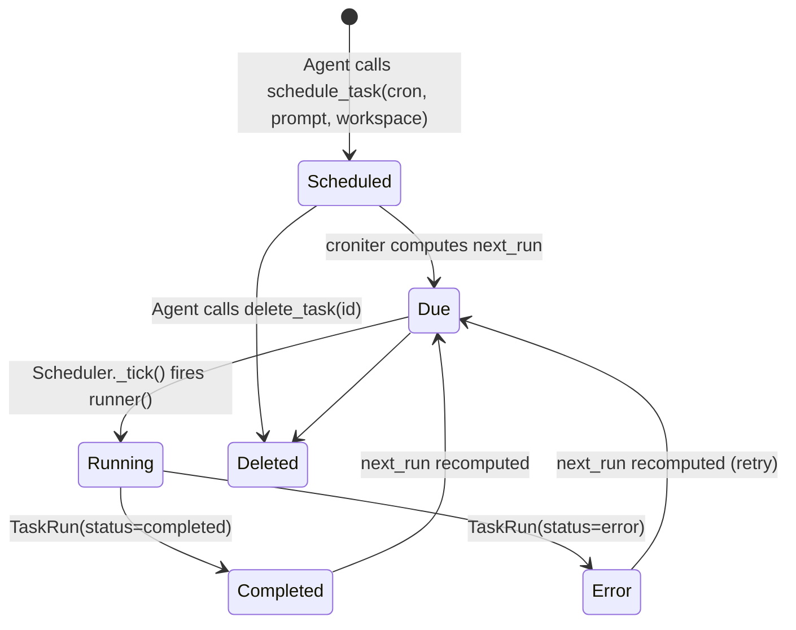

### 9.3 Task Execution Path

When the scheduler fires a task, the injected `runner` callback is called with a `ScheduledTask`. In the server context, this runner creates a headless `TurnEngine` session (no approver — tasks run non-interactively in AUTO mode) and returns a `TaskRun` record:

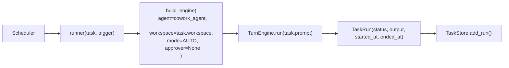

---

## 10. Extension Points

### 10.1 Adding a New LLM Provider (aisuite)

Create one file. No core changes required:

```
aisuite/providers/myprovider_provider.py

class MyproviderProvider(Provider):
    def chat_completions_create(self, model, messages, **kwargs):
        ...
    # Optional: override for native async
    async def achat_completions_create(self, model, messages, **kwargs):
        ...
```

`ProviderFactory` discovers it by glob (`*_provider.py`) and instantiates via `MyproviderProvider(**config)`. Install with `pip install 'aisuite[myprovider]'` by adding to `pyproject.toml` extras.

### 10.2 Adding a New Tool Toolkit (aisuite)

Return a list of annotated callables:

```python
# aisuite/toolkits/mytools.py
import aisuite as ai

def my_toolkit(*, root: str) -> list:
    def read_thing(id: str) -> str:
        """Read a thing by ID."""
        ...

    return [
        ai.tool(read_thing, metadata=ai.ToolMetadata(
            category="mytools", risk_level="low"
        ))
    ]
```

### 10.3 Adding a Skill (platform)

Drop a folder in `~/.coworker/skills/` or `{workspace}/.coworker/skills/`:

```
my-skill/
  SKILL.md        ← YAML frontmatter (name, description) + markdown instructions
  resources/      ← optional scripts, templates, reference files
```

`SkillLoader` discovers it at session start. The agent sees only the catalog (name + description) until it calls `load_skill("my-skill")` — progressive disclosure keeps the context window lean.

### 10.4 Adding a Messaging Connector (platform)

Implement `BasePlatformAdapter`:

```python
# platform/coworker/connectors/myplatform.py

class MyPlatformAdapter(BasePlatformAdapter):
    platform = "myplatform"

    async def connect(self) -> bool: ...
    async def disconnect(self) -> None: ...
    async def send(self, chat_id, text, *, thread_id=None) -> SendResult: ...
```

Register it in `platform/coworker/connectors/__init__.py`. Credentials are stored via `SecretStore` (Keychain / Credential Manager / env var fallback).

### 10.5 Adding a StateStore Backend (aisuite)

Implement the `StateStore` protocol:

```python
class MyStateStore:
    def save_state(self, thread_id, state, *, revision=None, metadata=None) -> StoredRunState: ...
    def load_state(self, thread_id) -> Optional[StoredRunState]: ...
    def delete_state(self, thread_id) -> None: ...
```

Pass it to `Runner.run(..., state_store=MyStateStore())`. The optimistic concurrency contract: increment `revision` on save; raise `StateConflictError` if the stored revision doesn't match the expected one.

### 10.6 Adding a TraceSink (aisuite)

```python
class MyTraceSink:
    def emit(self, event: TraceEvent) -> None:
        # write to your observability backend
        ...
```

Pass it to `Runner.run(..., trace_sinks=[MyTraceSink()])`.

### 10.7 Custom Tool Policy (aisuite)

```python
class AuditPolicy:
    def evaluate(self, context: ToolPolicyContext) -> ToolPolicyDecision:
        log_audit(context)
        return ToolPolicyDecision(allowed=True)

Runner.run(agent, "...", tool_policy=AuditPolicy())
# Or as a callable:
Runner.run(agent, "...", tool_policy=lambda ctx: ToolPolicyDecision(allowed=True))
```

### 10.8 Extension Point Summary

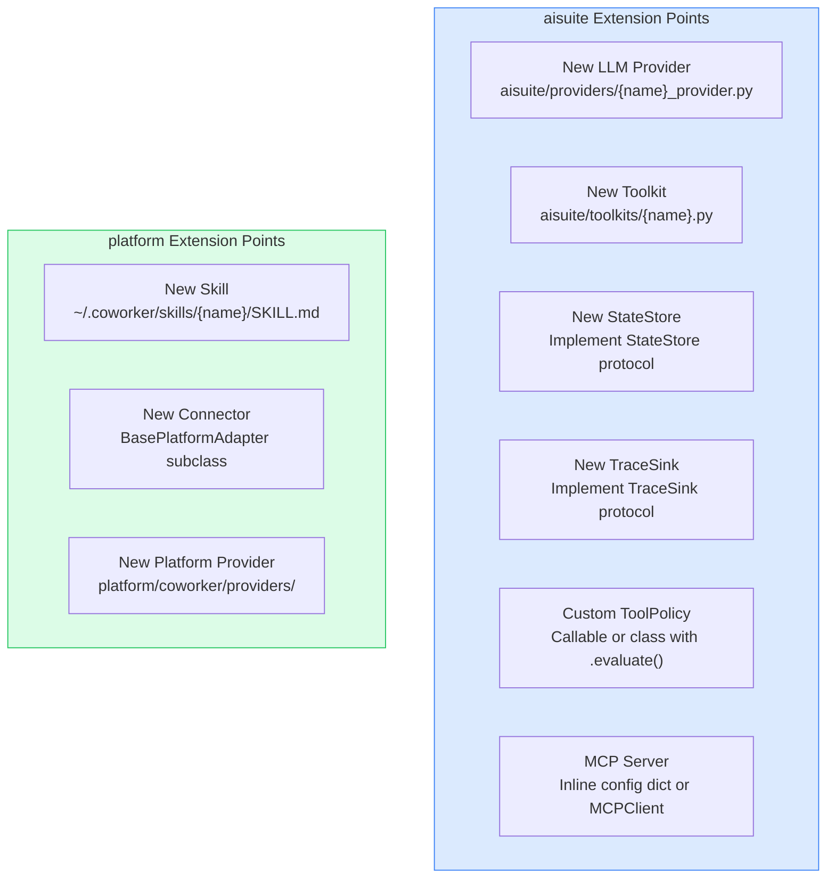

---

## Appendix: Key Architectural Decisions to Revisit

| Decision | Current State | Revisit When |
|----------|---------------|--------------|
| Dual provider abstraction | `aisuite/providers/` (22 providers) vs `platform/providers/` (3 providers, streaming) | When platform needs a 4th provider or aisuite gains native streaming |
| Single-user / single-machine | No RBAC, no tenant isolation, all data local | When multi-user or hosted deployment is required |
| Orphan-guard via PID polling | 1.5s poll on POSIX; handle wait on Windows | Known stable; revisit if extended background process support is needed |
| Memory scope model (GLOBAL / WORKSPACE / SESSION) | Coarse; no business-domain scopes | When domain entities (borrower, loan file) need isolated memory |
| Scheduler tick interval | 30 seconds | When sub-minute scheduled tasks are required |
| aisuite-js Agents API gap | Chat API only; no Runner, StateStore, or MCP client | When web surfaces need stateful agent sessions |
