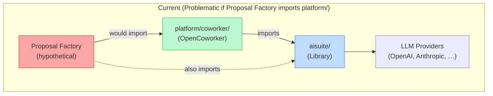
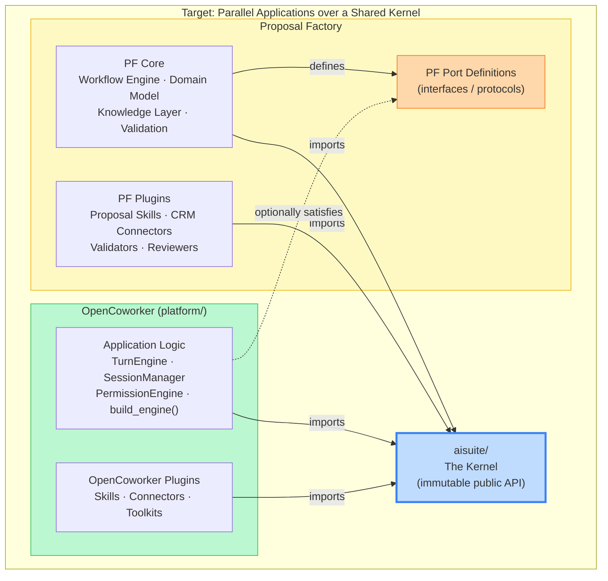
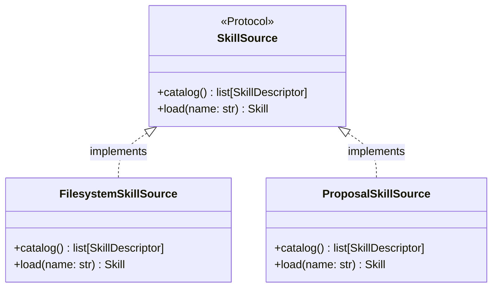
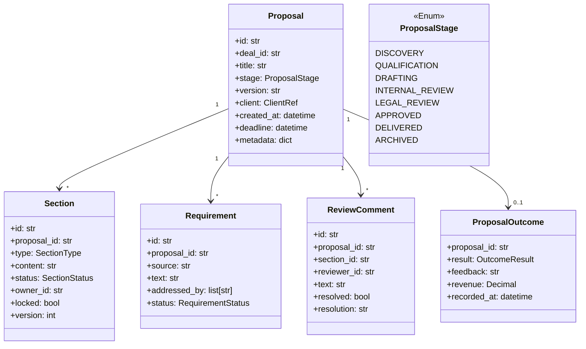
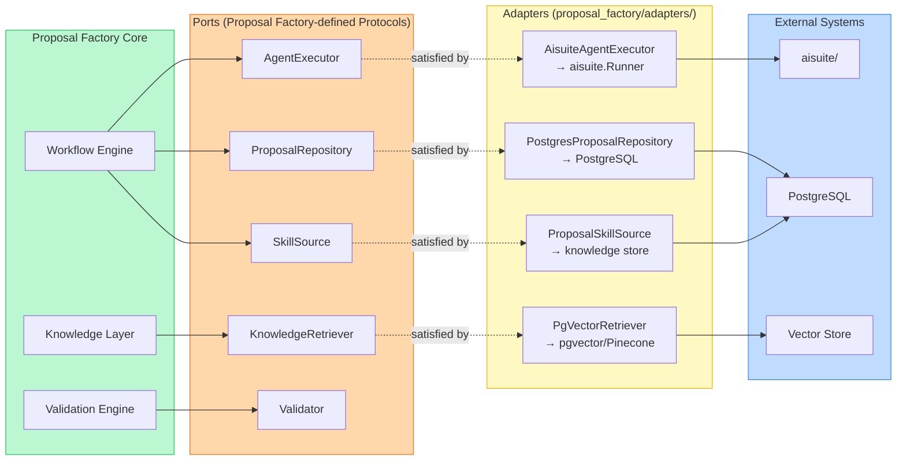

# Extensibility Strategy: Proposal Factory

> **Objective:** Proposal Factory must remain architecturally independent from OpenCoworker. It should be able to upgrade, replace, or abandon the OpenCoworker platform layer without rewriting its own logic. This document defines the dependency boundaries, the plugin surface, the interfaces that enforce those boundaries, and what each layer must own exclusively.

---

## Design Principle

The problem with the current structure is that both OpenCoworker and a naïve Proposal Factory implementation would be **applications of `aisuite/`**. If Proposal Factory imports from `platform/coworker/`, it becomes a fork of OpenCoworker, not a product built on it. Every upstream change in `platform/coworker/` becomes a Proposal Factory maintenance event.

The governing principle is **dependency inversion at the application boundary**:

> Proposal Factory depends on abstractions it defines. OpenCoworker satisfies those abstractions if and where useful. Neither application depends on the other.

The two applications share one thing: `aisuite/` — the LLM abstraction library. Everything above `aisuite/` is owned by the application that uses it.

---

## 1. Current Dependency Topology



This topology makes Proposal Factory a **dependent** of OpenCoworker. A breaking change in `TurnEngine`, `PermissionEngine`, or `build_engine()` breaks Proposal Factory.

---

## 2. Target Dependency Topology



**The rule:** Proposal Factory imports from `aisuite/` and from its own packages. It never imports from `platform/coworker/`. If it needs a capability that OpenCoworker has already built (e.g., `SkillLoader`), it either: (a) defines a protocol it needs satisfied, and adapts the OpenCoworker implementation behind that protocol, or (b) owns a simpler copy of the relevant logic.

---

## 3. What Must Never Be Modified

These components form the **immutable kernel**. They are depended on by both OpenCoworker and Proposal Factory. Changes here are breaking changes for both applications and must be treated as a public API release.

### 3.1 `aisuite/` Public API (`aisuite/__init__.py`)

Every symbol exported from `aisuite/__init__.py` is a public contract:

| Symbol | Why it is immutable |
|---|---|
| `Client` | The LLM routing and tool loop. Both applications call it. |
| `Agent` (dataclass) | The declarative agent definition. Passed to `Runner`. |
| `Runner` | The async multi-turn executor. Proposal Factory uses it directly for task execution. |
| `RunResult` / `RunState` | The persistence-safe representations of a completed or in-progress run. |
| `StateStore` (Protocol) | The persistence contract. Proposal Factory implements its own backend. |
| `ArtifactStore` (Protocol) | The artifact persistence contract. |
| `ToolPolicy` (Protocol) | The tool gate contract. Proposal Factory implements proposal-aware policies. |
| `TraceSink` (Protocol) | The observability contract. |
| `ToolMetadata` / `ToolPolicyContext` / `ToolPolicyDecision` | The metadata and decision types passed across every tool call. |
| `tool()` / `agent_tool()` decorators | The mechanism for attaching metadata to callables. |
| `toolkits.files()` / `toolkits.git()` / `toolkits.shell()` | Sandboxed built-in tool families. Used by both applications. |
| `MCPClient` | MCP integration. Used independently by both applications. |

### 3.2 `aisuite/provider.py` — `Provider` ABC and `ProviderFactory`

The provider naming convention (`{name}_provider.py` → `{Name}Provider`) and the `Provider` abstract base class must not change. Both applications rely on the same underlying providers.

### 3.3 `aisuite/framework/message.py` — Message Normalization Types

`ChatCompletionResponse`, `Message`, `ChatCompletionMessageToolCall` — the canonical response envelope. These are the types both applications receive from `Client`. Changing their shape breaks both.

### 3.4 `aisuite/tracing/` — TraceEvent Schema

The `TraceEvent` dataclass and `TraceEventType` enum define the observability wire format. Once Proposal Factory routes its trace events to an enterprise observability backend, changes to this schema require migration.

---

## 4. What Should Become Plugins

These components already have extension points or are good candidates for formalization as a plugin contract. The action required is to **make the contract explicit** (define a Protocol or interface) so that Proposal Factory can provide its own implementation without depending on the OpenCoworker implementation.

### 4.1 Skills — Already a Plugin System

**Current mechanism:** `SkillLoader` discovers `SKILL.md` files from filesystem directories.  
**Plugin contract already exists:** Drop a folder with `SKILL.md` into `~/.coworker/skills/` or `{workspace}/.coworker/skills/`.  
**What to formalize:** Define a `SkillSource` protocol that abstracts over the source of skills (filesystem, database, remote registry). Proposal Factory implements a `ProposalSkillSource` that reads from its knowledge repository, not from a filesystem directory. OpenCoworker's `SkillLoader` becomes one implementation of `SkillSource`.



### 4.2 Connectors — Already a Plugin System

**Current mechanism:** `BasePlatformAdapter` ABC with `connect()`, `disconnect()`, `send()`, `handle_message()`.  
**What to formalize:** The adapter pattern is correct. Proposal Factory registers connectors (CRM, document management, e-signature, proposal portals) without touching OpenCoworker's connector registry. The `ToolRegistry` is the assembly point — Proposal Factory builds its own registry populated with proposal connectors.

Proposal Factory connectors to build as plugins:
- CRM connector (Salesforce / HubSpot / Dynamics)
- Document management connector (SharePoint, Google Drive)
- E-signature connector (DocuSign, Adobe Sign)
- Proposal portal connector (Loopio, Qvidian, RFPIO)
- Calendar/scheduling connector (for review deadline management)

### 4.3 StateStore — Already a Protocol

**`StateStore`** in `aisuite/agents/state_store.py` is defined as a Python `Protocol`. Proposal Factory implements `ProposalStateStore` backed by its own database schema, including proposal-specific fields (deal ID, stage, version). It registers this store when constructing `Runner` instances — no OpenCoworker involvement.

### 4.4 ArtifactStore — Already a Protocol

Same pattern as StateStore. Proposal Factory's `ProposalArtifactStore` understands proposal versioning: artifact IDs encode `(deal_id, section_id, version)`. OpenCoworker's `FileArtifactStore` is irrelevant to Proposal Factory.

### 4.5 ToolPolicy — Already a Protocol

**`ToolPolicy`** is a Python `Protocol` with a single method. Proposal Factory defines `ProposalToolPolicy` that enforces proposal-specific rules: no shell execution during client review mode, knowledge writes require validation approval, pricing tools require a senior reviewer's active session. This is injected at `Runner.run()` time — no OpenCoworker involvement.

### 4.6 TraceSink — Already a Protocol

Proposal Factory implements `ProposalTraceSink` that routes events to an enterprise SIEM or audit log, capturing proposal activity for compliance. It may additionally track proposal-scoped metrics (tokens per proposal stage, validation pass rate, revision count).

### 4.7 Provider Adapters — Convention-based Discovery

LLM providers are discoverable by naming convention. Proposal Factory can add enterprise-specific providers (Azure OpenAI with private endpoints, internal LLM deployments) by adding files to `aisuite/providers/` without modifying any existing file.

### 4.8 MCP Servers — Configuration-based

Any MCP server can be attached to a `Runner` via inline config or `MCPClient`. Proposal Factory attaches domain-specific MCP servers (proprietary pricing calculator, compliance rule engine, internal search) through configuration. No code changes to either `aisuite/` or `platform/coworker/`.

---

## 5. What Proposal Factory Must Own Exclusively

These are components that Proposal Factory must build, own, and control. They must not exist in OpenCoworker (adding them there would couple the applications). They must not import from OpenCoworker internals.

### 5.1 Proposal Domain Model

The core entity model. Proposal Factory is the only system with authority over these types.



### 5.2 Workflow Engine

The stage-transition machine. OpenCoworker has no equivalent — its `TurnEngine` is a single turn, not a multi-day lifecycle. Proposal Factory owns this entirely.

The engine manages:
- Stage transitions with guard conditions (cannot advance to `INTERNAL_REVIEW` without all `DRAFTING` sections locked)
- Human-in-the-loop wait steps (emit a `ReviewRequested` event, suspend, resume on `ReviewCompleted`)
- Parallel task branches with joins (simultaneous section drafting, joined at stage completion)
- Event-driven triggers (advance to `LEGAL_REVIEW` when internal review is approved)
- Durable state that survives process restart

### 5.3 Knowledge Layer

The retrieval infrastructure for institutional knowledge. This is Proposal Factory's exclusive data asset. It must not be mixed with OpenCoworker's `MemoryStore` (which holds conversational facts, not a document corpus).

Proposal Factory's knowledge layer consists of:
- **Knowledge Store**: versioned document storage (past proposals, case studies, pricing history, legal language, competitor intelligence)
- **Ingestion Pipeline**: document parsing, chunking, embedding, and indexing
- **Retrieval Interface**: semantic search protocol (`KnowledgeRetriever`) implemented by the vector store backend
- **Knowledge Lifecycle**: approval workflow for adding/updating/deprecating knowledge entries

### 5.4 Validation Engine

A structured pipeline of validators that produce `ValidationFinding` records with severity, location, and resolution guidance. Each validator is a plugin (implementing `Validator` protocol). Proposal Factory owns the pipeline orchestration, the finding schema, and the resolution tracking.

### 5.5 Review Orchestration

Multi-reviewer workflow, comment threading, approval delegation, and notification routing. Built on top of the aisuite `Runner` (for automated reviewer agents) and Proposal Factory's own Workflow Engine (for the review stage state machine). OpenCoworker's single-gate PLAN mode is a primitive that inspires this, but the multi-reviewer model is Proposal Factory's own design.

### 5.6 Proposal Task Executor

The bridge between Proposal Factory's Workflow Engine and `aisuite.Runner`. Proposal Factory owns this adapter — it constructs `Agent` and `Runner` instances using only `aisuite/` public API, configures them with proposal-domain tools and policies, executes them, and maps `RunResult` back to workflow task outcomes. This component is the only place Proposal Factory calls into `aisuite/`.

---

## 6. Interface Catalogue — The Boundary Contracts

These are the protocols/interfaces that define the seams between Proposal Factory and the systems it depends on or integrates with. Each one is defined **inside Proposal Factory's package**. External implementations (aisuite backends, OpenCoworker components) satisfy them — but only as adapters, never as direct imports.

### 6.1 `AgentExecutor` — Decouples from aisuite.Runner directly

```
Protocol: AgentExecutor
  execute(task: ProposalTask) -> TaskResult
  execute_async(task: ProposalTask) -> AsyncIterator[TaskEvent]
  cancel(task_id: str) -> None

Implementation: AisuiteAgentExecutor
  Wraps aisuite.Agent + aisuite.Runner
  Owned by Proposal Factory
  Imports only from aisuite/
```

Why: If `Runner`'s signature changes (new async semantics, different return type), only `AisuiteAgentExecutor` needs to change — not the Workflow Engine or the task orchestration layer.

### 6.2 `KnowledgeRetriever` — Decouples from the vector store backend

```
Protocol: KnowledgeRetriever
  search(query: str, filters: KnowledgeFilter) -> list[KnowledgeChunk]
  get(id: str) -> KnowledgeDocument
  related(chunk_id: str, limit: int) -> list[KnowledgeChunk]
```

Implementations: `PineconeRetriever`, `WeaviateRetriever`, `PgVectorRetriever` — all Proposal Factory-owned. The vector store vendor is an implementation detail hidden behind this interface.

### 6.3 `ProposalRepository` — Decouples from the persistence backend

```
Protocol: ProposalRepository
  save(proposal: Proposal) -> None
  get(id: str) -> Optional[Proposal]
  list(filters: ProposalFilter) -> list[ProposalSummary]
  save_section(section: Section) -> None
  save_comment(comment: ReviewComment) -> None
  record_outcome(outcome: ProposalOutcome) -> None
```

Implementations: `PostgresProposalRepository`, `InMemoryProposalRepository` (tests). Completely independent of OpenCoworker's StateStore.

### 6.4 `WorkflowStore` — Durable workflow state

```
Protocol: WorkflowStore
  save_workflow(workflow: WorkflowInstance) -> None
  load_workflow(proposal_id: str) -> Optional[WorkflowInstance]
  pending_tasks(due_before: datetime) -> list[WorkflowTask]
  complete_task(task_id: str, result: TaskResult) -> None
  await_event(task_id: str, event_type: str) -> None
  emit_event(proposal_id: str, event: WorkflowEvent) -> None
```

### 6.5 `Validator` — The validation plugin contract

```
Protocol: Validator
  name: str
  stage: ProposalStage      # which stage this validator applies to
  severity_if_fails: Severity
  validate(proposal: Proposal, context: ValidationContext) -> list[ValidationFinding]
```

Validator implementations are pure plugins: completeness validator, compliance cross-reference validator, pricing consistency validator, legal language validator, win probability scorer. Each is independent, testable, and registered by name.

### 6.6 `ReviewOrchestrator` — Decouples review routing from notification

```
Protocol: ReviewOrchestrator
  request_review(proposal: Proposal, stage: ProposalStage, reviewers: list[ReviewerRef]) -> ReviewRequest
  await_completion(request_id: str) -> ReviewDecision
  notify(reviewer: ReviewerRef, request: ReviewRequest) -> None
  delegate(request_id: str, from: ReviewerRef, to: ReviewerRef) -> None
```

### 6.7 `CapabilityCatalog` — Decouples from the capabilities data service

```
Protocol: CapabilityCatalog
  search(requirement: str) -> list[Capability]
  get(id: str) -> Capability
  list_service_lines() -> list[ServiceLine]
  match(rfp_requirements: list[Requirement]) -> CapabilityMatrix
```

### 6.8 `SkillSource` — Decouples from filesystem skill loading

```
Protocol: SkillSource
  catalog() -> list[SkillDescriptor]
  load(name: str) -> Skill
```

Proposal Factory's `ProposalSkillSource` reads proposal-domain skills from the knowledge repository, enabling versioned, governed skills alongside conversational filesystem skills from OpenCoworker's `SkillLoader`.

---

## 7. Dependency Inversion Map

For each place where Proposal Factory might be tempted to import from `platform/coworker/`, the inversion is:

| OpenCoworker Component | Temptation | Correct Inversion |
|---|---|---|
| `TurnEngine` | Call it directly for agent execution | Define `AgentExecutor` protocol; build `AisuiteAgentExecutor` on top of `aisuite.Runner` |
| `PermissionEngine` | Reuse mode enforcement | Define `ExecutionPolicy` protocol for Proposal Factory's access rules; implement independently |
| `SkillLoader` | Load skills for the agent | Define `SkillSource` protocol; `FilesystemSkillSource` wraps `SkillLoader` as an adapter |
| `ToolRegistry` | Register tools before a run | Proposal Factory builds its own `ToolRegistry` using `aisuite.tool()` decorator; same pattern, independent instance |
| `MemoryStore` | Persist conversational facts | Use `aisuite.StateStore` for run state; own `ProposalRepository` for domain entities; do not share OpenCoworker's memory database |
| `SecretStore` | Access stored credentials | Define `CredentialProvider` protocol; adapt OpenCoworker's store or use a separate enterprise secrets vault |
| `SessionManager` | Manage agent sessions | Proposal Factory's Workflow Engine owns session lifecycle; it constructs `Runner` instances directly |
| `Scheduler` | Schedule automated proposal tasks | Proposal Factory's `WorkflowStore.pending_tasks()` drives its own scheduler; OpenCoworker's Scheduler is not involved |
| `BasePlatformAdapter` | Build messaging connectors | Proposal Factory's connectors implement the same pattern but are registered in Proposal Factory's own connector registry |

---

## 8. Package Structure

The target structure that enforces this separation:

```
ocw-proposalfactory/
│
├── aisuite/                     ← KERNEL: immutable public API
│   ├── __init__.py              ← The only file Proposal Factory imports from
│   ├── client.py
│   ├── agents/                  ← Runner, StateStore, ArtifactStore, ToolPolicy protocols
│   ├── providers/               ← 22+ provider adapters
│   ├── toolkits/                ← files, git, shell
│   ├── mcp/
│   └── tracing/
│
├── platform/                    ← OPENCOWORKER APPLICATION: imports aisuite/, nothing else
│   └── coworker/                ← Never imported by Proposal Factory
│
├── proposal_factory/            ← PROPOSAL FACTORY APPLICATION: imports aisuite/, nothing else
│   ├── __init__.py
│   ├── ports/                   ← Interface definitions (Protocols)
│   │   ├── agent_executor.py    ← AgentExecutor, TaskEvent, TaskResult
│   │   ├── knowledge.py         ← KnowledgeRetriever, KnowledgeChunk
│   │   ├── repository.py        ← ProposalRepository, WorkflowStore
│   │   ├── review.py            ← ReviewOrchestrator, ReviewerRef
│   │   ├── validation.py        ← Validator, ValidationFinding
│   │   ├── capabilities.py      ← CapabilityCatalog, Capability
│   │   └── skills.py            ← SkillSource, SkillDescriptor
│   ├── domain/                  ← Proposal, Section, Requirement, ReviewComment, Outcome
│   ├── workflow/                ← Workflow Engine, stage machine, task dispatcher
│   ├── knowledge/               ← Ingestion pipeline, retriever implementations
│   ├── validation/              ← Validator implementations (completeness, compliance, …)
│   ├── adapters/                ← Implementations of ports using aisuite or external systems
│   │   ├── aisuite_executor.py  ← AisuiteAgentExecutor wrapping aisuite.Runner
│   │   ├── pgvector_retriever.py
│   │   ├── postgres_repository.py
│   │   └── opencoworker_skills.py  ← Optional: adapter wrapping SkillLoader if reuse desired
│   ├── connectors/              ← CRM, document management, e-signature
│   ├── skills/                  ← Proposal methodology skills (SKILL.md content)
│   └── server/                  ← Proposal Factory API surface (separate from coworker-server)
│
├── aisuite-js/                  ← TypeScript chat API (unchanged)
├── tests/                       ← aisuite library tests (unchanged)
└── docs/
```

**The import rule, enforced by tooling (e.g., `import-linter` or `ruff` boundary rules`):**

```
proposal_factory/ → aisuite/          ALLOWED
proposal_factory/ → platform/         FORBIDDEN
platform/         → aisuite/          ALLOWED
platform/         → proposal_factory/ FORBIDDEN
aisuite/          → platform/         FORBIDDEN
aisuite/          → proposal_factory/ FORBIDDEN
```

---

## 9. The Adapter Layer in Detail

The `proposal_factory/adapters/` directory is the **only place** where Proposal Factory touches the outside world. Each adapter file is thin: it translates between Proposal Factory's port interface and an external system's API.



The Workflow Engine calls `AgentExecutor.execute()` — it knows nothing about `aisuite.Runner`, `aisuite.Agent`, or how models are called. The `AisuiteAgentExecutor` adapter translates the `ProposalTask` into an `aisuite.Agent`, constructs the `Runner`, injects a `ProposalToolPolicy` (which implements `aisuite.ToolPolicy`), and maps the `RunResult` back into a `TaskResult`. If aisuite's `Runner` API changes, only `AisuiteAgentExecutor` changes.

---

## 10. What This Buys Over Five Years

| Scenario | Without This Architecture | With This Architecture |
|---|---|---|
| aisuite releases a breaking `Runner` change | Proposal Factory breaks wherever it calls `Runner` | One file changes: `aisuite_executor.py` |
| OpenCoworker redesigns `TurnEngine` | Proposal Factory breaks | No impact — Proposal Factory never imported it |
| Proposal Factory replaces the vector store | Rewrite all knowledge retrieval code | Swap one adapter: `PgVectorRetriever` → `WeaviateRetriever` |
| Enterprise requires on-premise LLM | Add a provider to `aisuite/providers/` | Both applications get it free |
| Proposal Factory adds a new validator | Modify a validation service | Implement `Validator` protocol, register it |
| A second product (Contract Factory) is needed | Fork Proposal Factory or inherit its coupling | Both products import `aisuite/`, share ports pattern |
| Compliance requires audit log of all agent actions | Instrument every call site | Implement one `TraceSink`, inject at startup |
